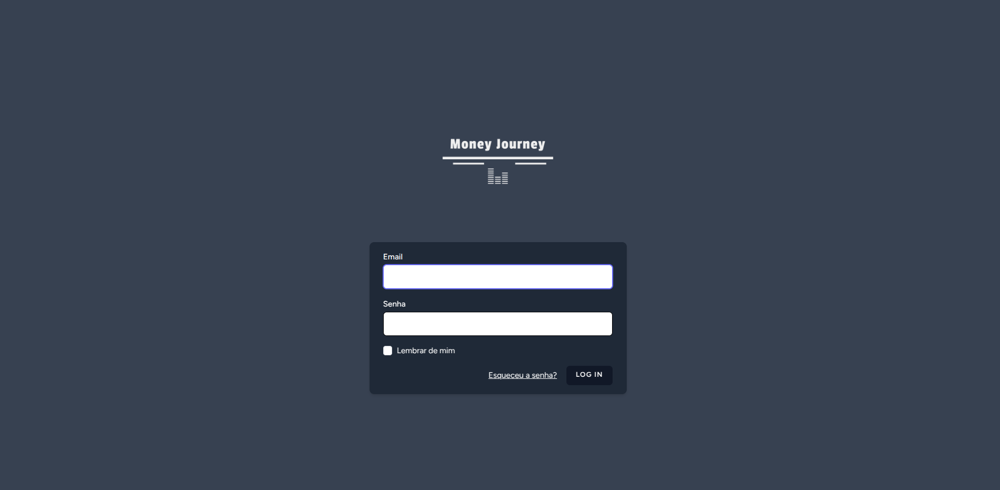
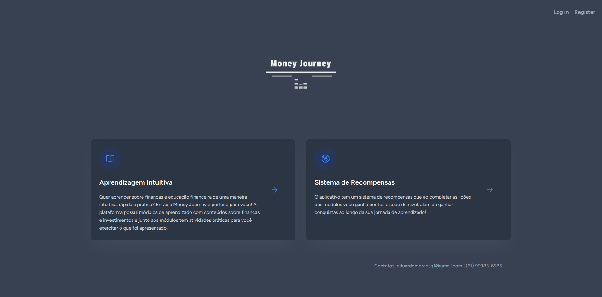
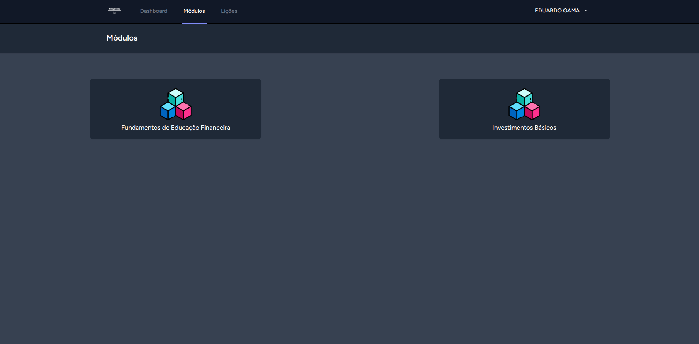
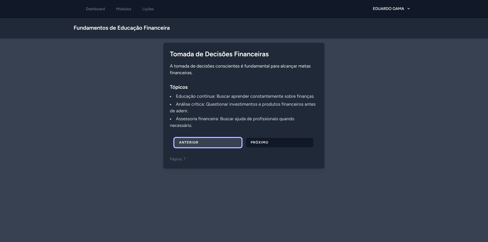
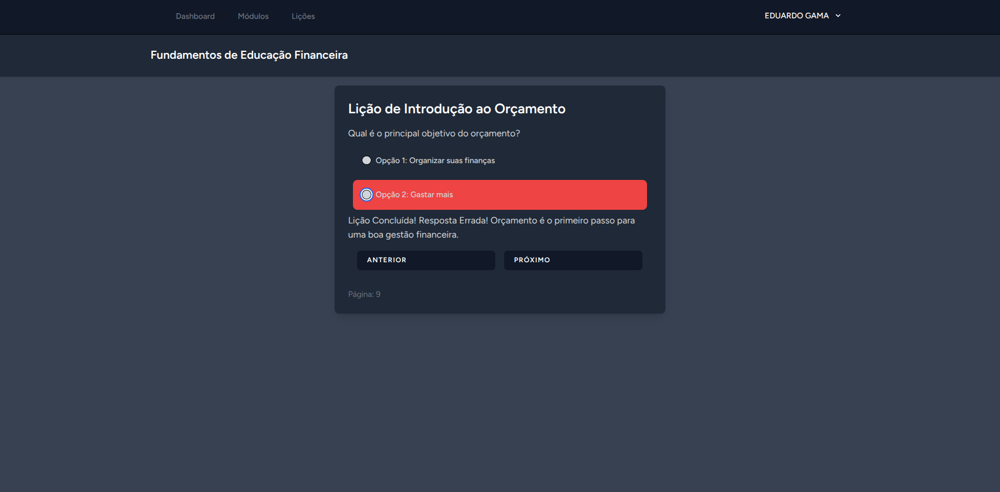
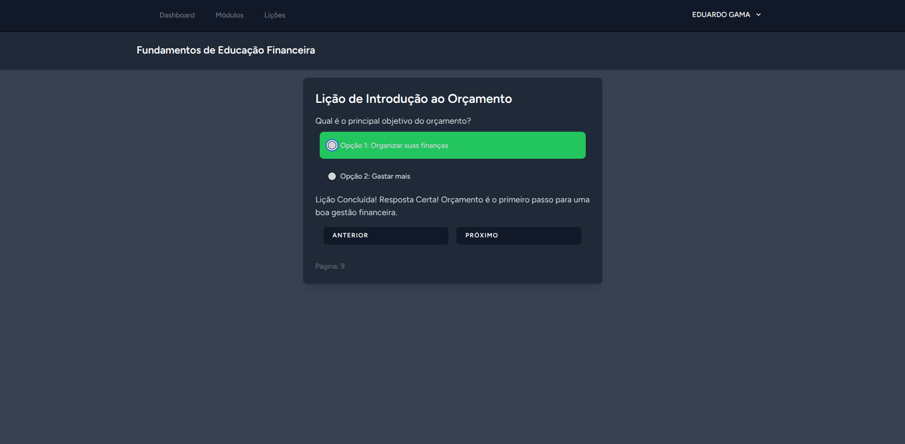
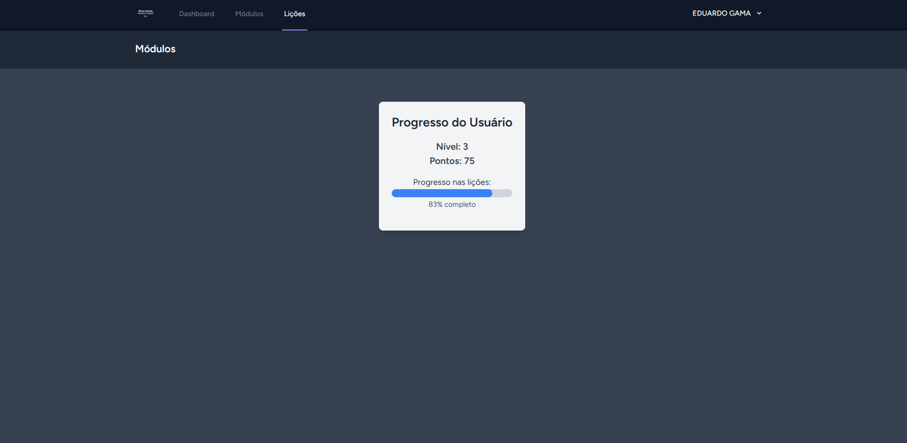
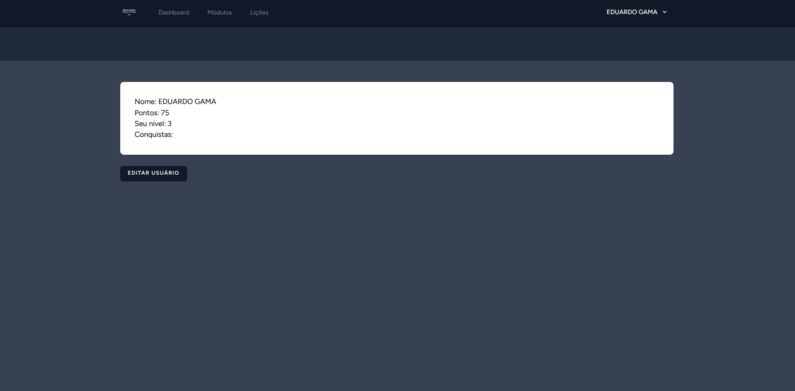

# 💸 MoneyJourney - Plataforma Gamificada de Educação Financeira

MoneyJourney é um MVP de uma plataforma web gamificada de educação financeira voltada para jovens que foi desenvolvido para a disciplina de Startups. A proposta do projeto é ensinar conceitos financeiros de forma interativa, com um sistema de recompensas, níveis de usuário e módulos de aprendizado baseados em quizzes.

## 🚀 Tecnologias Utilizadas

- **Laravel**: Backend robusto em PHP
- **Vue.js**: Frontend reativo e moderno usando JavaScript
- **Inertia.js**: Integração entre Laravel e Vue.js
- **Laravel Breeze**: Autenticação simples com integração nativa com Inertia

## 🧩 Funcionalidades

- ✅ Cadastro e autenticação de usuários
- ✅ Módulos de aprendizado com lições e quizzes
- ✅ Sistema de progresso por níveis e XP
- ✅ Recompensas e pontuação por desempenho
- ✅ Barra de progresso com visualização do avanço
- ✅ Interface amigável e responsiva

## 📸 Imagens do Projeto

### 🎓 Tela de Login


### 🏠 Página Inicial


### 📦 Módulos Disponíveis


### 📘 Conteúdo do Módulo


### ❌ Resposta Incorreta no Quiz do Final do Módulo


### ✅ Resposta Certa no Quiz do Final do Módulo


### 📊 Progresso do Usuário


### 👤 Perfil do Usuário


## ⚙️ Instalação

### Pré-requisitos

- PHP >= 8.1
- Laravel >= 10.10
- Composer
- Node.js e npm
- Banco de dados usado no desenvolvimento >= mysql | Use o banco de sua preferência

### Passos

- Após clonar o repositório crie e configure seu arquivo .env com as configurações do seu banco de dados

```bash
# Clone o projeto em algum diretório
git clone https://github.com/seu-usuario/moneyjourney.git
cd moneyjourney

# Instale as dependências PHP
composer install

# Instale as dependências JS
npm install

# Rode as migrations do banco
php artisan migrate --seed

# Suba o ambiente JS
npm run dev

# Suba o projeto
php artisan serve
